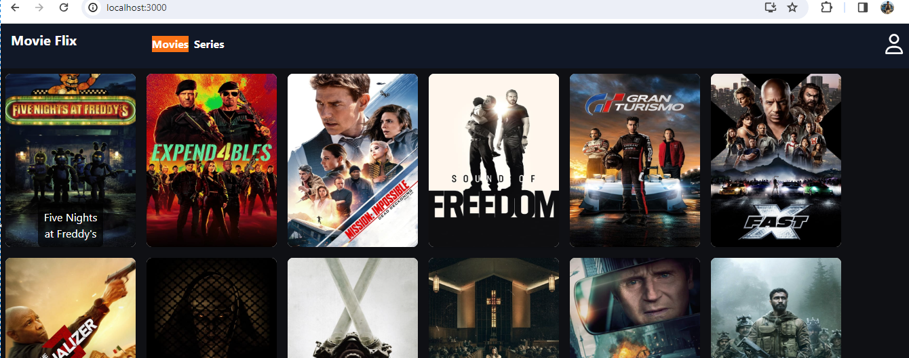
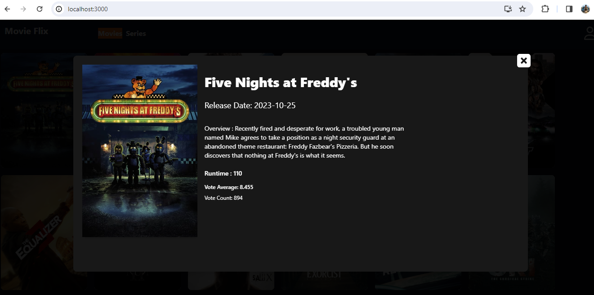
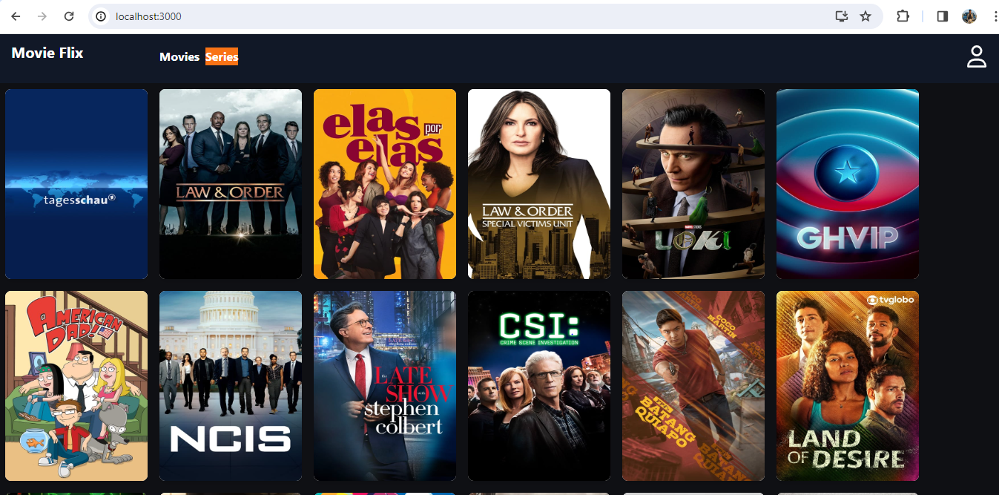
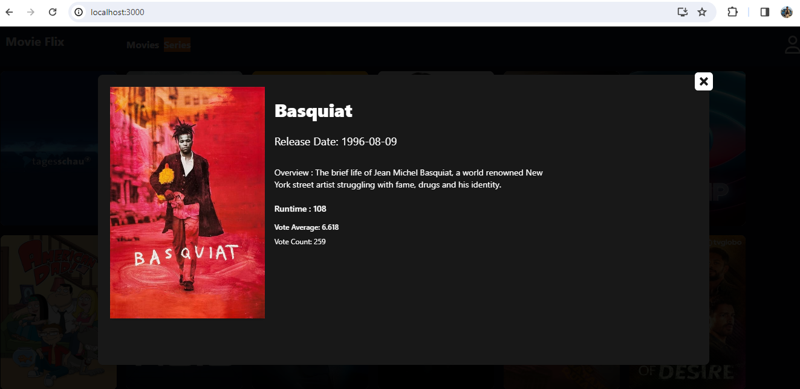

### `How to run the project/app`

- Git clone https://github.com/RajendraKumar-V/my-tmdb-app
- npm install
- npm start
- Open [http://localhost:3001](http://localhost:3001) to view it in the browser

### `npm test`

To launch the test runner in interactive watch mode for your project, please use the following command. This will help you ensure the correctness of your code and assist in identifying any issues during development:

npm test

### `Functionality implemented`

-Created custom hooks to fetch data from API based on the API URL's.
-TabNavigation functionality to switch between movies and series tab.
-Error handling by implementing error boundaries.
-Implemented routing.
-Overlay concept implemented on click on movie card it will be on movie list page itself
 and movie detail page displayed in a pop-up.Same functionality implemented for series also. 
-On click on movie cards in movies list page based upon on the movie id 
It will be redirected to movie detail page.
-On click on close button it will redirect user to movie list page.
-On click on series cards in series list page based upon on the series id 
 it will be redirected to series detail page.
-On click on close button it will redirect user to movie list page.
-On mouse hover on movie cards image will zoom in.
-On mouse hove on movie cards,movie title displayed in a tooltip.
-For rich UI experience implemented tail wind css.

### `Screen shots`
-Movie list screen 

-Movie detail screen

-Series list screen

-Series detail screen

### `Frameworks/Libraries used`

React
Tailwind
Jest

